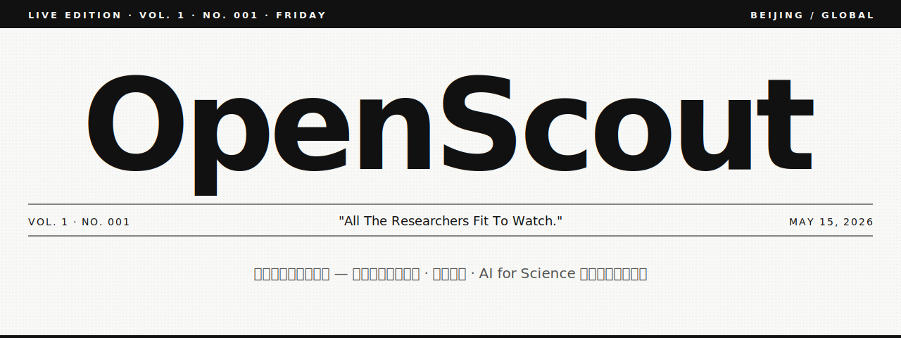

<p align="center">
  
</p>

<p align="center">
  <strong><em>All The Researchers Fit To Watch.</em></strong><br>
  A daily newspaper for early-stage AI researchers — embodied AI, world models, AI for Science.
</p>

<p align="center">
  <a href="LICENSE"></a>
  <a href=".github/workflows/ci.yml"></a>
  
  
  <a href="https://github.com/Chen17-sq/OpenScout"></a>
</p>

---

## What it does

OpenScout reverse-maps from papers to authors. Every morning at 09:00 Beijing
it ingests the previous 24 hours of **arXiv**, **HuggingFace Daily Papers**,
and **OpenReview**-tracked conferences (ICLR / NeurIPS / ICML), enriches
every researcher via **OpenAlex**, **Semantic Scholar**, **DBLP**, **Papers
with Code**, and **GitHub**, then ranks them through a three-pillar
**Investment Lens** (breakthrough × commercial × buzz). Investors land on
one page and see who is worth a closer look today — with reasons attached.

## Why this exists

Investors covering early-career AI researchers face one problem: by the time
a paper trends on alphaXiv or the media picks it up, the window is closed.
The delta between *"this person is going to matter"* and *"everyone knows"*
is six months to a year. OpenScout aggressively backfills advisor → student
lineage so unknown junior names surface the moment they co-author with a
researcher already tracked.

## Live snapshot

Output of `openscout doctor` on the prod box at v1.12:

```
Papers              1,528
  ├─ with emails       125    (extracted from arxiv.org/html/<id>)
  └─ with code_url      67    (regex + Papers with Code)
Researchers         5,823
  └─ anchors            67    (curated + OpenAlex-verified)
Paper-author links  8,282
Advisor edges          94    (co-author × same-country × h-index)
Latest brief    2026-05-16
External services   all 7 ✓ HTTP 200
SQLite DB          4.6 MB
```

## Investment Lens

The headline feature. Replaces the v1 stage-based investability heuristic with
one rooted in actual paper-level signals: every recent paper gets a
`work_score` in [0, 1], composed of three pillars.

| Pillar | What it measures | Inputs |
| --- | --- | --- |
| **Breakthrough** | Academic impact | S2 influential citations, oral/spotlight acceptance |
| **Commercial** | Adoption + IP | GitHub stars (log-normalized), has-code bonus, industry-author bonus (top AI lab email) |
| **Buzz** | Community attention | HF likes, alphaXiv comments, spotlight |

```
work_score = 0.35 × breakthrough + 0.35 × commercial + 0.30 × buzz
```

A **12-month-half-life exponential decay** is applied to the breakthrough and
commercial pillars before combination, so a 2026 PhD first-author paper outranks
a 2021 senior-author hit. Buzz is left untouched — it decays on its own.

Per-pillar scores and a short `reasons` list (e.g. `["S2 cites 47", "github ★ 2.1k", "@meta"]`)
are persisted on the paper, so the UI can render a transparent "why this
pick" badge. The researcher's `investability_score_v2` rolls up the top three
recent papers.

**Real top picks today** (from `top_investment_picks(limit=5, window_days=30)`):

```json
[
  { "slug": "shuangrui-ding",  "name_en": "Shuangrui Ding",  "country": "CN", "role": "phd", "score": 0.621,
    "top_paper": { "title": "WildClawBench: A Benchmark for Real-World, Long-Horizon Agent Evaluation",
                   "work_score": 0.497, "reasons": ["github ★ 369", "buzz 1.7"] } },
  { "slug": "hanbo-cheng",     "name_en": "Hanbo Cheng",     "country": null, "role": "phd", "score": 0.542,
    "top_paper": { "title": "Unlocking Complex Visual Generation via Closed-Loop Verified Reasoning",
                   "work_score": 0.452, "reasons": ["github ★ 25.5k", "buzz 1.0"] } },
  { "slug": "mantas-mazeika",  "name_en": "Mantas Mazeika",  "country": "CN", "role": "phd", "score": 0.540,
    "top_paper": { "title": "HarmBench: A Standardized Evaluation Framework for Automated Red Teaming",
                   "work_score": 0.450, "reasons": ["github ★ 948", "buzz 1.0"] } },
  { "slug": "baoying-chen",    "name_en": "Baoying Chen",    "country": "CN", "role": "phd", "score": 0.527,
    "top_paper": { "title": "DRCT: Diffusion Reconstruction Contrastive Training",
                   "work_score": 0.439, "reasons": ["buzz 1.5"] } },
  { "slug": "xiyu-ren",        "name_en": "Xiyu Ren",        "country": "CN", "role": "phd", "score": 0.487,
    "top_paper": { "title": "MemLens: Benchmarking Multimodal Long-Term Memory in Large VLMs",
                   "work_score": 0.406, "reasons": ["buzz 2.3"] } }
]
```

## Deep Dive

For one-researcher-at-a-time intensive enrichment — sparse pages for
auto-discovered first-authors hurt trust, so deep-dive is the manual override.
A single `POST /researchers/{slug}/deep-dive` runs **12 sources** in three phases:

1. **Discovery** — `arxiv_author` · `openalex_match` · `semantic_scholar_discover` ·
   `github_discover` · `dblp_discover`. Finds missing IDs from the name.
2. **Consumption** — `openalex_full` · `affiliation_discover` · `github_profile` ·
   `huggingface_profile` · `homepage_llm`. Uses the IDs to pull rich data
   (full work list, bio, org, location, models, advisor / interests via DeepSeek).
3. **Synthesis** — `bio_synth` · `institution_tag` · `signal_tag` · `signature_paper`.
   Fills remaining gaps and emits the user-facing chips.

**Rate limit**: 3 dives / IP / UTC day. Returns `429 + Retry-After` on excess.
The limit and per-IP counter live in the `deep_dive_quota` table; swap
`_ip_for_request` for a user-id helper once auth lands.

**Admin bypass**: scripted dives (ops, batch refresh, cron) can skip the
quota by passing the same `X-Ingest-Secret` header used by `/admin/ingest`:

```bash
curl -X POST \
  -H "X-Ingest-Secret: $INGEST_SECRET" \
  http://localhost:8000/researchers/yann-lecun/deep-dive
```

Header-only — never expose the secret in a query string, and never expose
it to the browser. The bypass is silently refused when `INGEST_SECRET` is
unset or still the default `"change-me"`.

**Persistence**: results write into the researcher row directly. The
`deep_dive_sources_used` JSON records the timestamp per source; a re-dive
skips any source <30 days old unless `--force`. Results live forever — a
deep-dive only re-burns quota when the cache expires.

## Tag taxonomy

The `Researcher.tags` JSON list mixes three `type` values, surfaced as
differently-styled chips in the UI:

| Type | Source | Example |
| --- | --- | --- |
| `topic` | LLM topic classifier + paper-level concepts | `embodied AI`, `world models`, `AI4Sci` |
| `institution` | `current_affiliation_id` resolved against the Institution table | `Tsinghua University`, `Meta FAIR` |
| `signal` | Computed every deep-dive from combined fields | see below |

**The 5 auto-computed signal tags:**

| Label | Trigger |
| --- | --- |
| 🔥 high-potential / 高潜 | `investability_score_v2 ≥ 0.5` |
| ⭐ incoming AP / 即将入职 AP | `current_role == "incoming_ap"` |
| 🚀 prolific junior / 学界新星 | PhD/postdoc with `h_index ≥ 10` |
| 📈 high-impact per paper / 单篇高引 | `citation_count / h_index ≥ 80` (≥ 500 cites, h ≥ 5) |
| 🎓 graduating soon / 即将毕业 | `current_role == "phd"` and `career_stage_year ≥ 4` |

Signal tags are wiped + recomputed on every dive — a researcher who was Y3
last time and is now a postdoc loses "graduating soon" automatically.

## Data sources

OpenScout doesn't run its own crawlers when an aggregator exists. Every source
exposes a public API or HTML view; each is hit politely (rate-limited, UA-tagged).

| Source | What we pull | Added |
| --- | --- | --- |
| arXiv API | new papers per topic | v1.0 |
| arXiv HTML (`arxiv.org/html/<id>`) | author emails · code URLs | v1.0 |
| OpenAlex | author IDs · h-index · citations · concepts | v1.0 |
| OpenReview | ICLR / NeurIPS / ICML accepted + tier | v1.0 |
| HuggingFace Daily Papers / Models | trending list + per-author model releases | v1.0 |
| Papers with Code | paper → code + stars | v1.0 |
| DBLP | stable author PIDs | v1.0 |
| Wikidata | researcher photos (P18) | v1.0 |
| GitHub | repo star counts + user bio (deep-dive) | v1.0 |
| Semantic Scholar | h-index · influential citations · homepage | v1.6 |
| alphaXiv | comment-count buzz signal | v1.8 |
| Twitter / X via Nitter | bio + 5 most recent research tweets | v1.11 |
| Zhihu | CN-only biographical info for known handles | v1.11 |
| News mentions | 36氪 / TechCrunch / The Information scans | v1.11 |
| Faculty announcements | MIT / Stanford / CMU / Berkeley / Tsinghua / PKU incoming-AP pages | v1.11 |
| Google Patents | industry-affiliated researchers' patents | v1.11 |
| Conference committees | NeurIPS / ICLR / ICML PC / AC / SAC membership | v1.11 |
| Academic awards | ACM Doctoral Dissertation · NSF CAREER · TR35 · Sloan · Packard | v1.11 |
| Affiliation discovery | S2 / OpenAlex / bio → resolved Institution row | v1.11 |
| DeepSeek | Chinese one-liner · topic filter · homepage extraction | v1.0 |
| Anthropic Claude | same (alternate provider) | v1.0 |
| Resend | daily digest email | v1.0 |

## Stack

| Layer | Choice |
| --- | --- |
| Frontend | SvelteKit 2 · Svelte 5 · Tailwind 4 · `marked` |
| Backend | FastAPI · SQLAlchemy 2 · Pydantic 2 · `psycopg` / sqlite |
| DB | SQLite (local + Fly volume) → Postgres 16 + pgvector (planned) |
| Scrapers | `pyalex` · `httpx` · `selectolax` · `pypdf` · `arxiv` |
| LLM | DeepSeek or Anthropic Claude — unified `llm.complete()` |
| Cron | GitHub Actions → `POST /admin/ingest` (auth: `INGEST_SECRET`) |
| Tests | pytest · ruff format / lint · svelte-check |
| Error tracking | Sentry SDK (frontend + backend; no-ops without `SENTRY_DSN`) |

## Quick start

```bash
git clone https://github.com/Chen17-sq/OpenScout.git
cd OpenScout

# Backend
uv sync --all-extras
uv run openscout init-db
uv run openscout seed

# Optional: pick an LLM provider (DeepSeek or Anthropic)
echo "DEEPSEEK_API_KEY=sk-..." >> .env
echo "LLM_PROVIDER=deepseek"   >> .env

# Full daily pipeline (ingest → enrich → score → render)
uv run openscout daily

# Frontend
cd web && npm install && npm run dev      # http://localhost:5174
```

`openscout doctor` reports DB state, key availability, external-service
reachability, and disk usage. Run it whenever something looks off.

## Pipeline

`openscout daily` runs this sequence; each step is isolated so a single
failure does not stop the rest. The exit code is the count of failed steps.

```
Phase 1 — ingest
  arxiv (embodied · world_models · ai4sci)  →  HF daily  →  conference papers

Phase 2 — researcher enrichment
  resolve-institutions  →  enrich-openalex (anchors)  →  backfill-works  →  infer

Phase 3 — paper enrichment
  arxiv-html (emails, code)  →  code_url regex  →  github-stars  →  pwc  →  dblp
  alphaxiv buzz  →  refresh-citations  →  wikidata-photos  →  hf-models

Phase 4 — derived
  signature-papers  →  lineage  →  score (v1)  →  score-papers (Investment Lens v2)

Phase 5 — LLM (auto-skip without provider key)
  translate (Chinese one-liner)  →  classify (topic relevance)

Phase 6 — extended sources (v1.11)
  affiliations  →  twitter  →  zhihu  →  news-mentions  →  faculty-scan
  patents  →  awards  →  conference-committees  →  dedupe

Phase 7 — render
  daily brief markdown  →  9 social SVG cards  →  banner + og-card

Phase 8 — distribute (optional)
  email digest via Resend  →  deep-dive-queue for top-investability researchers
```

## CLI

```
make api / make web / make dev       # FastAPI :8000 · SvelteKit :5174 · both

openscout init-db                    # create tables + run idempotent migrations
openscout seed                       # load seeds/*.yaml
openscout doctor                     # health check
openscout daily                      # full pipeline

# ingest
openscout ingest --topic embodied --limit 50
openscout hf-papers --limit 30
openscout conference-papers
openscout backfill-works

# enrichment
openscout enrich-openalex --only-anchors
openscout resolve-institutions
openscout arxiv-html
openscout code-urls
openscout github-stars
openscout pwc
openscout dblp
openscout alphaxiv
openscout refresh-citations
openscout wikidata-photos
openscout hf-models
openscout infer                      # heuristic country / role / affiliation
openscout affiliations               # discover current_affiliation_id (v1.11)

# v1.11 extended sources
openscout twitter
openscout zhihu
openscout news-mentions
openscout faculty-scan
openscout patents
openscout awards
openscout conference-committees
openscout dedupe

# scoring / compute
openscout signature-papers
openscout lineage
openscout score
openscout score-papers               # Investment Lens (breakthrough × commercial × buzz)

# per-researcher deep-mode
openscout deep-dive <slug>           # 12 sources, ~30s; cached per source for 30d
openscout deep-dive-queue --limit 20 # auto-pick top investment-score researchers

# llm
openscout translate-papers
openscout classify-topics --topic ai4sci

# render / distribute
openscout brief
openscout banner
openscout social-cards
openscout send-digest                # needs RESEND_API_KEY
```

## Architecture

```
       ┌──────────────────────────────────────────────────────────┐
       │  arXiv · HF · OpenReview · OpenAlex · S2 · DBLP · PwC ·  │
       │  Wikidata · GitHub · alphaXiv · Twitter · Zhihu · News · │
       │  Faculty pages · Patents · Awards · Committees · Resend  │
       └──────────────────────────┬───────────────────────────────┘
                                  │
                                  ▼
       ┌──────────────────────────────────────────────────────────┐
       │  scraper/*  — one module per source, all idempotent      │
       │  + work_scoring.py — three-pillar Investment Lens        │
       │  + deep_dive.py    — on-demand 12-source enrichment      │
       └──────────────────────────┬───────────────────────────────┘
                                  ▼
                          ┌──────────────┐
                          │ SQLite       │
                          │ (Fly volume) │
                          └──────┬───────┘
                                 │
        ┌────────────────────────┼─────────────────────────┐
        ▼                        ▼                         ▼
  ┌────────────┐         ┌─────────────────┐        ┌──────────────┐
  │ brief/     │         │ api/ FastAPI    │        │ web/         │
  │ generate.py│         │ /researchers    │ ◀───── │ SvelteKit    │
  │ → markdown │         │ /papers /og/*   │        │ (Vercel)     │
  └─────┬──────┘         │ /investment     │        └──────────────┘
        │                │ /deep-dive (3/d)│
        ▼                │ /jobs /admin    │
  reports/{date}.md      └─────────────────┘
```

Core tables: `researchers · papers · institutions · topics · paper_authors ·
paper_topics · researcher_topics · relationships · affiliations · signals ·
daily_briefs · deep_dive_quota · jobs`.

## Configuration

API keys and secrets are looked up in this order:

1. Shell environment variable
2. `OpenScout/.env` (gitignored)
3. macOS Keychain — `service=OpenScout`, account = key name (skipped on non-macOS)

| Variable | Purpose |
| --- | --- |
| `DEEPSEEK_API_KEY` | Primary LLM (cheap; default provider) |
| `ANTHROPIC_API_KEY` | Alternate LLM (set `LLM_PROVIDER=anthropic`) |
| `SEMANTIC_SCHOLAR_API_KEY` | Higher S2 rate limit; deep-dive runs faster |
| `GITHUB_TOKEN` | Lifts GitHub API limit from 60 → 5,000 / hr |
| `RESEND_API_KEY` + `NOTIFY_EMAIL_TO` | Daily email digest |
| `INGEST_SECRET` | Bearer auth for `POST /admin/ingest` (cron) |
| `SENTRY_DSN` | Backend error tracking; no-op when unset |
| `OPENSCOUT_VERSION` | Sentry release tag (set in CI from git SHA) |
| `LLM_PROVIDER` | `deepseek` (default) or `anthropic` |
| `DATABASE_URL` | `sqlite:///./openscout.db` locally; `sqlite:////data/openscout.db` on Fly |
| `FRONTEND_ORIGIN` | CORS allowlist for the deployed frontend |
| `VITE_API_BASE` | Frontend env: URL of the deployed backend |

```bash
# Persist a key in Keychain (Touch-ID protected after first unlock):
security add-generic-password -s OpenScout -a DEEPSEEK_API_KEY -w "sk-..."

# Or set it in CI:
gh secret set DEEPSEEK_API_KEY -R Chen17-sq/OpenScout
```

## Deployment

Production runs as **Vercel (frontend) + Fly.io (backend, Tokyo)** with the
SQLite DB on a 1 GB Fly volume. Postgres migration is planned (see ROADMAP),
but volume-backed SQLite is sufficient for v1.12 launch traffic.

### Backend (Fly.io)

```bash
brew install flyctl && flyctl auth login
flyctl launch --no-deploy
flyctl volumes create openscout_data --size 1 --region nrt
flyctl secrets set \
    DEEPSEEK_API_KEY=sk-... \
    SEMANTIC_SCHOLAR_API_KEY=... \
    GITHUB_TOKEN=ghp_... \
    RESEND_API_KEY=re_... \
    NOTIFY_EMAIL_TO=you@example.com \
    INGEST_SECRET=$(openssl rand -hex 32) \
    SENTRY_DSN=https://...@sentry.io/... \
    FRONTEND_ORIGIN=https://openscout.vercel.app
flyctl deploy
```

Health check at `/health`; auto-stop / auto-start machines on idle keeps the
bill near zero. `release_command = python -m openscout.cli init-db` applies
schema migrations on every deploy (idempotent `ADD COLUMN`s are no-ops).

### Frontend (Vercel)

`web/vercel.json` configures SvelteKit + pnpm build + Tokyo (`hnd1`) region.
Auto-deploys on push to main. Set `VITE_API_BASE=https://openscout.fly.dev`
in the Vercel project env.

### Daily cron

GitHub Actions hits `POST {backend}/admin/ingest` every morning at 01:00 UTC
(09:00 Beijing) with the `INGEST_SECRET` bearer token. See `.github/workflows/daily.yml`.

## Roadmap

Short version: rate-limit done · jobs queue + SSE next · Postgres + magic-link
auth tier-1. New scrapers (1.1–1.8) land in parallel streams. Full file:
[ROADMAP.md](ROADMAP.md).

**Deliberately out of scope**

- CRM features (notes, ratings) — this is a display layer, not workflow.
- Lead-gen / outreach automation — emails surface for manual research, not bulk-send.

## Contributing

See [CONTRIBUTING.md](CONTRIBUTING.md). Especially welcome:

- New anchor researchers in `seeds/researchers.yaml`
- New seed institutions or topics
- New aggregator sources (add a `scraper/<name>.py`, register in `cli.py`, append to `deep_dive.SOURCES` if it fits the 12-source flow)

The "do not guess Chinese names" rule is firm — only add `name_zh` when
verified from a source the researcher controls (their homepage, paper byline,
or a column they author). The OpenAlex enricher fills the rest where it can.

## Acknowledgments

The newsprint visual language is borrowed from
[kickstarter-china-tracker](https://github.com/Chen17-sq/kickstarter-china-tracker),
the sister project this one was prototyped against. Heavy reliance on
[OpenAlex](https://openalex.org), [pyalex](https://github.com/J535D165/pyalex),
[DBLP](https://dblp.org), [Papers with Code](https://paperswithcode.com),
[Semantic Scholar](https://www.semanticscholar.org),
[HuggingFace](https://huggingface.co/papers), and
[OpenReview](https://openreview.net).

## License

[MIT](LICENSE)
